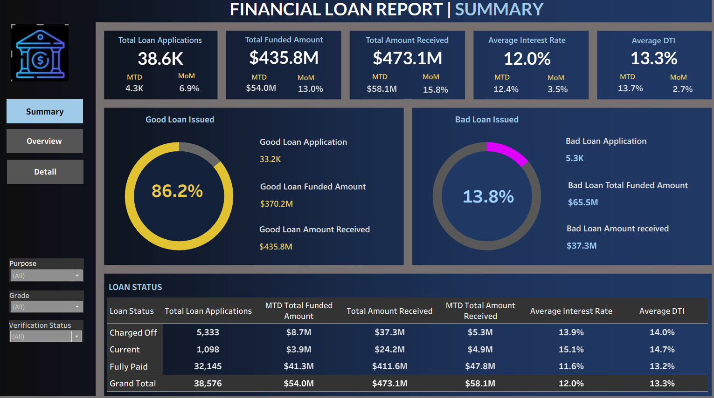
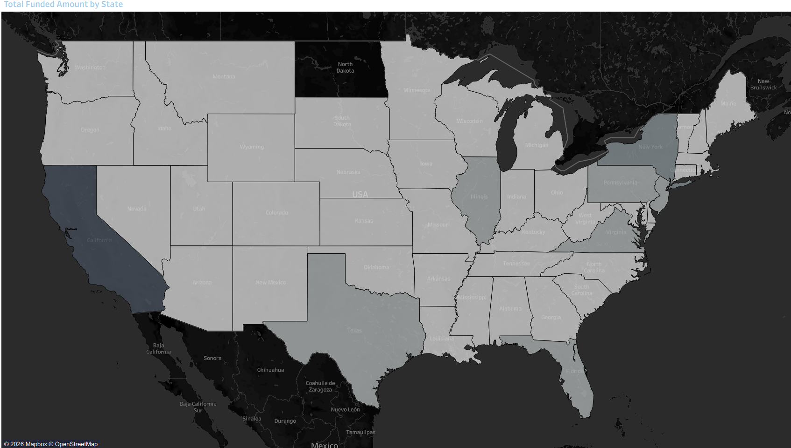
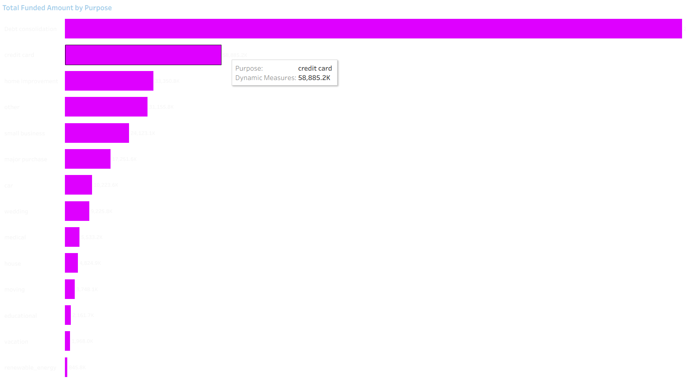

# Bank Loan Performance & Risk Analysis Dashboard

SQL | Python | Power BI | Tableau | Financial Analytics

## Project Overview
Developed an end-to-end financial analytics solution to analyze loan portfolio performance, repayment behavior, and borrower risk segmentation using SQL, Python, Power BI, and Tableau.

The project focuses on identifying high-risk loan segments, monitoring key financial KPIs, and enabling data-driven portfolio analysis through interactive dashboards.

---

## Business Objectives
- Analyze loan repayment and default trends
- Identify high-risk borrower segments
- Monitor portfolio quality and funding performance
- Track month-over-month lending trends
- Support decision-making through KPI-driven reporting

---

## Tools & Technologies
- SQL
- Python (Pandas, NumPy)
- Power BI
- Tableau

---

## Dataset
- 38,000+ loan records
- Financial, customer, and repayment-related attributes

---

## Key KPIs
- Total Loan Applications
- Total Funded Amount
- Total Repayment
- Recovery Rate
- Good vs Bad Loan Percentage
- Average Interest Rate
- Debt-to-Income Ratio (DTI)
- Month-over-Month Performance

---

## Technical Implementation

### SQL Analysis
- CTEs for modular query development
- Window Functions (LAG, LEAD, RANK)
- KPI aggregation and segmentation logic
- Reusable analytical tables for reporting

### Python Processing
- Data cleaning and preprocessing
- Data validation checks
- Standardization of categorical variables

### Dashboard Development
- Interactive KPI dashboards in Power BI and Tableau
- Risk segmentation analysis
- Portfolio performance monitoring
- Trend-based visual reporting

---

## Dashboard Preview

### Power BI Dashboards

#### KPI Summary

#### Good vs Bad Loan Analysis

#### Loan Status Analysis

---

### Tableau Dashboards

#### Loan Summary

#### State Analysis

#### Purpose Analysis

## Business Insights
- Identified high-risk borrower segments contributing to elevated default exposure
- Analyzed repayment efficiency and recovery trends
- Evaluated funding allocation across states and borrower categories
- Improved visibility into portfolio quality metrics

---

## Repository Contents
- SQL Queries
- Python Analysis Scripts
- Power BI Dashboard
- Tableau Dashboard
- Documentation & Reports

---

## Skills Demonstrated
SQL • Python • Power BI • Tableau • ETL • KPI Reporting • Financial Analytics • Data Validation • Risk Segmentation • Business Intelligence
